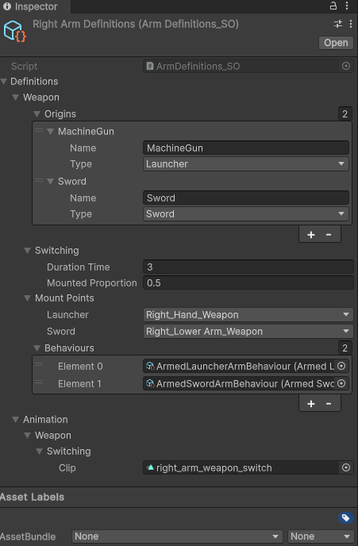
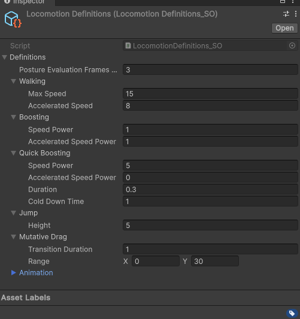
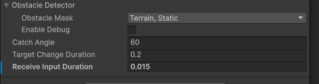

<!--  -->
# MNAC
MNAC（迷你装甲核心）的目标是借鉴装甲核心制作一款第三人称2.5D动作射击游戏

### 先叠个甲 😇
>没经验，没参考和教程，一切从零开始，还得边上班边做这个项目，这些情况导致项目的进度很慢，而且大框架已经迭代两版了，目前这个完成度是我的极限了。😅
>目前还有很多功能没做，代码写的一坨，注释更是没写，自己都一点难绷。还是期望各位大佬多多指点，多提issue呀😚

## 如何操作 🎮
---
- 目标选择：有锁定目标时，朝着下一个目标拖动鼠标（~~目前不咋好使就是了~~）
- 射击：左手`鼠标左键` / 右手`鼠标右键`
- 换弹：`对应手臂的射击键`+`R`
- 切换武器：`对应手的射击键`+`T` 
- 移动：`W`、`A`、`S`、`D`
- 爆发推进：`LeftShift`
- 跳跃：`Space`
- 唤出UI界面：`Esc`

## 功能 ✨ 

---

- 基础库
  - 轻量时间轴, 请查看`./Assets/Scripts/Utilities/Timeline/`
  - [状态机](#状态机-️)
  - 环境和运动基础，请查看`./Assets/Physics/Envroment | Locomotion/`
  - 组件化和黑板机制， 请查看`./Assets/Utilities/Blackboards | Composable/`
  - [武器](#武器-)
  - [角色交互](#角色交互-)
  - [动画控制](#动画-️)
- 角色
  -  [手臂行为](#手臂控制-)
  -  [腿部行为](#腿部控制-)
  -  [运动控制](#运动控制-)
  -  [AI控制](#ai控制-)
- 玩家
  - [目标锁定](#目标锁定-)

应该还有部分功能没有写进来，各位大佬就请自行查阅了，

## 展望 🔭
- 更多角色： 制作其他类型的角色，完善AI逻辑，眼下期望是复刻`AC6`第一关Boss武装直升机
- 配置项管理： 由目前ScriptableObject改为以AssetBundle为基础的配置文件，在此基础上提供编辑器模式下动态修改配置项的功能
- 更多武器和武器种类：在已有武器类型的基础上添加更多武器，有机会的话也会增加更多武器种类
- 武器镜像化功能：目前武器都是以右手握持为基础制作，后续需要制作一个快速的、自动化的将右手武器镜像化成支持左手握持的功能
- 背部武器支架：补充背部武器支架，添加相应的武器类型，并完善基于武器支架的武器切换行为和动画
- 角色美术：更换角色模型，完善角色的行为特效（首当其冲的的就是喷口特效）

## 已知问题 🐞
  - 使用剑进行冲刺，当冲刺结束后角色会类似踩空一样从空中下落
  - 使用剑进行挥砍时，因为朝向角度和挥砍动画的原因无法挥砍到目标
  - 装备了发射的手臂进行瞄准时，有几率不会准确瞄准目标，在切换武器之后恢复
  - 角色接入AI控制后，会产生意外的旋转行为

## 功能简介 🧱 

### 状态机 ⚙️
---
> ./Assets/Scripts/States/

本着~~好像挺简单的，自己手搓吧~~的憨憨思想，写出了第一版状态机（~~苦难折磨就此开始了~~），随着后面需求升级，憨憨思想又发力了几次，不怎么好调试的一坨就此诞生了😂
#### StatemachineBase
最简单的状态机，只支持状态和过渡的简单执行

#### PlayableStatemachineBase
基于`Statemachine`，搭配`PlayableStateBase`为状态机提供持续时间支持，可以通过继承并重写`PlayableStateBase`的：
- `[ FromPrevious | ToNext ]StateTransitionBegin`
- `[ FromPrevious | ToNext ]StateTransitionRunning`
- `[ FromPrevious | ToNext ]StateTransitionEnd`

方法实现过渡时的细粒度控制

#### WithCallbackState
基于`PlayableStateBase`，提供`OnEnter`、`OnUpdate`、`OnExit`方法执行时的回调支持

#### BlendingTransition
基于`PlayableTransition`，参考Unity状态机混合过渡的工作过程，为状态之间的过渡提供诸如**固定退出时间**、**起始偏移**以及**打断**功能（目前打断只支持`None`和`Next`选项，~~好像够用了~~）

#### SubStatemachineState和SubStatemachineTransition
提供分层状态机的支持（~~以一种简单但巨抽象的方式~~）以及向子状态机混合过渡的支持

> 目前状态机的调试全依赖打日志，后面写编辑器看看好不好解决，不好解决的话就得考虑换成其他成熟方案了

### 武器 🏹
---
> ./Assets/Scripts/Weapons_New/

提供武器相关支持，目前支持的武器类型有**发射器**、**剑**和**投掷物**，其中**发射器**和**剑**采用组件化设计，可以很简单的通过继承组件基类并添加到武器中来扩展武器现有的行为

### 角色交互 🤝

---

> ./Assets/Scripts/Interaction/

为角色之间交互，例如目标获取、友军检查、伤害、击退等功能提供支持

#### Influence
底层使用`InfluenceCore`作为影响控制中心，通过向其添加实现了`IInfluence`接口的对象来对角色产生实际影响。同时，借助定义的大量交互接口，简化角色之间的交互行为，一个角色只需从游戏对象上获取需要的接口，并进行操作，就可以对另一个角色产生影响

### AI控制 🤖

---

>./Assets/Scripts/AI/

借助大框架高度模块化的设计，AI可以很简单的接入现有角色的行为控制，例如只需向`HumanoidController`添加使用AI控制的`HumanoidInput`和`TargetLocker`模块，AI就可以接管控制`HumanoidController`的角色

> AI的行为决策使用`Behavior Designer`插件，目前AI的行为决策完全是残疾状态，只花了一两天快速学习、制作的行为树还需要大量工作进行完善

### 动画 🎞️

---

> ./Assets/Scripts/Animations/

基于`Playable API`的强大功能，封装了一个简单的动态动画控制树系统。

`Playable API`原有的链接和权重调整方式比较繁琐，在封装后，向树中已有节点添加新的子节点，就可以简单的添加新的可播放部分，而权重，可以通过获取节点的`OutputSetting`对象快速设置

### 手臂控制 💪
---
> ./Assets/Scripts/Behaviours/Arms
> ./Assets/Scripts/Characters/Humanoid/Arms

#### ArmController
 手臂控制核心`./Assets/Tests/Characters/Humnaoid/Arms/ArmController`主要控制武器切换、装备武器后的对应行为和两者的动画过渡。

`ArmController`的状态机有这几个状态
- 闲置
- 切换武器
- 装备武器

没有装备武器时，会进入闲置状态，但当触发切换武器且成功切换出武器后，基于手臂行为的高可扩展设计，`ArmController`会根据武器类型决定激活哪种行为并进入装备武器状态，于此同时，动画控制器会加载激活行为中设置的动画节点，借助`Playble API`强大的动态动画控制能力，动画控制器会控制动画从武器切换动画丝滑过渡到目标行为当前的动画

<!--  -->

#### 可扩展手臂行为
通过继承`./Assets/Scripts/Behaviours/Arms/Weapons/Interfaces/IArmedWeaponArmBehaviour`接口，可以快速制作一个新的手臂行为，目前已经制作好的行为和相应动画控制器：
  
**ArmedLauncher**
>./Assets/Scripts/Behaviours/Arms/Weapons/Launcher/
./Assets/Scripts/Characters/Humanoid/Arms/Weapons/Launcher/

**ArmedSword**
>./Assets/Scripts/Behaviours/Arms/Weapons/Sword/
>./Assets/Scripts/Characters/Humanoid/Arms/Weapons/Sword/

 目前`ArmController`只会从`ArmDefinitons_SO`中加载`./Assets/Scripts/Characters/Humanoid/Arms/Weapons/ArmedWeaponArmBehaviourBase_SO`的子类对象，这个加载流程还是太麻烦了，后面涉及到编辑器编写的时候看看怎么改进

### 腿部控制 🦵

---

> ./Assets/Scripts/Behaviours/Foots
> ./Assets/Scripts/Characters/Humanoid/Legs

使用`Final IK`插件，脚部实现了简单的地面适应，在一些基础移动状态下，脚部会随着地面高度贴合地面

### 运动控制 🏃
---
> ./Assets/Scripts/Characters/Humanoid/Locomotion/

#### LocomotionCore

运动控制核心`./Assets/Scripts/Characters/Humanoid/Locomotion/LocomotionCore`控制角色的移动和相应动画，其中内置几种行为：
- Boosting，基础运动，并带有接触地面时产生动态阻尼的功能
- QuickBoosting
- Jump
- RotationByPlayer，内置旋转模块，可以替换掉，像是`AIRotationControl`中那样做的

因为基于`./Assets/Scripts/Physics/Locomotion/LocomotionCore.cs`，角色所有移动行为都由`LocomotionCore`控制，其他模块可以继续向其中添加运动模块去影响运动，最典型的例子就是`ArmedSwordArmBehaviour_SO`和`Knockback`中做的那样，对`LocomotionCore`的行为进行扩展，并添加新的模块到里面

<!--  -->

#### 模块
通过继承`LocomotionModuleBase`可以快速编写一个运动模块，将模块添加到运动核心中并激活，该模块就可以开始工作
> 目前模块的执行顺序依赖添加顺序，这也导致一些对执行顺序有需求的场景下，只能通过移除然后再次添加模块的方式解决，后面需要为模块引入执行顺序的排序方式

### 目标锁定 ⭕
---
> ./Assets/Scripts/Interaction/InteractionManager
> ./Assets/Scripts/Interaction/Targets_New/GameObjsInScreenCatcher
> ./Assets/Scripts/Player/PlayerTargetLocker
> ./Assets/Scripts/Interaction/TargetLocker/PlayerTargetLocker

目标锁定在没有目标时，始终跟随鼠标，当敌人出现在玩家屏幕内且不在障碍物后面，且锁定器目前没有锁定目标时，会筛选距离玩家最近的敌人作为锁定目标并始终跟随，直到敌人死亡、离开屏幕、或者玩家拖动鼠标切换目标。

<!--  -->

> 目前版本的锁定器工作方式仅在敌人零散、不扎堆的时候还算好使😅。之前有考虑过采用类似解限机那样，给一个框，始终跟随鼠标，敌人出现在框中间的时候锁定，离框解锁，但考虑到大型单位锁定和框内很多单位的情况下也不怎么好处理，也就给毙了，后面还需要尝试其他工作方式